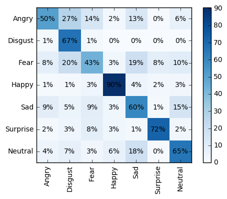

# happy-and-you-know-it

Facial Emotion Recognition using deep residual learning.

## Motivation

This is my attempt to have a machine learn facial expressions from an image.
(Something I seem to have a hard time doing)

## Accuracy

The model provided in models/resnet20.h5 is a ResNet with 20 layers.

[Human accuracy is 65±5 % ](https://arxiv.org/abs/1307.0414)

- Training

       Accuracy = 67.91 %

       Loss = 0.8633

- Validation
       
       Accuracy = 66.48 %
       
       Loss = 0.9397
       
 - Confusion matrix on Validation data
       
      

## Installation

1. Install a virtualenv in the project directory

       virtualenv venv

2. Activate the virtualenv
    - On Windows:

          cd venv/Scripts
          activate
      
    - On Linux
    
          source venv/bin/activate

3. Install the requirements

        pip install -r requirements.txt
        
4. Try it out!
        python server.py 

        Open browser and visit http://127.0.0.1:5000/

## Dataset

Challenges in Representation Learning: Facial Expression Recognition Challenge (ICML 2013)
> The data consists of 48x48 pixel grayscale images of faces. The faces have been automatically registered so that the face is more or less centered and occupies about the same amount of space in each image. The task is to categorize each face based on the emotion shown in the facial expression in to one of seven categories (0=Angry, 1=Disgust, 2=Fear, 3=Happy, 4=Sad, 5=Surprise, 6=Neutral).

The dataset is available for download on [Kaggle](https://www.kaggle.com/c/challenges-in-representation-learning-facial-expression-recognition-challenge/data).

## Model Summary

ResNet20 model summary

